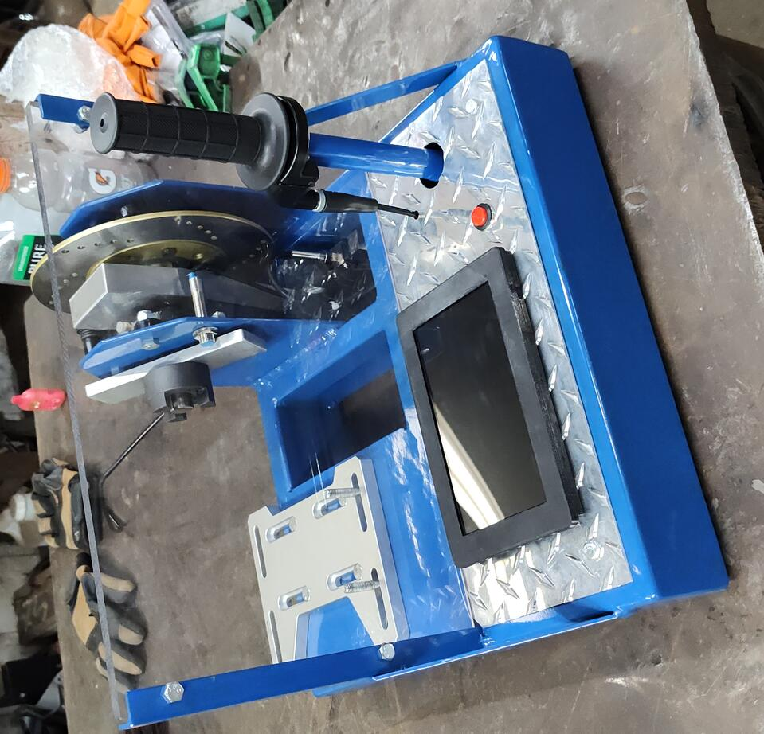
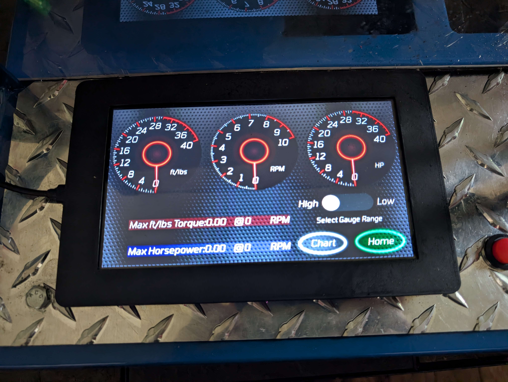
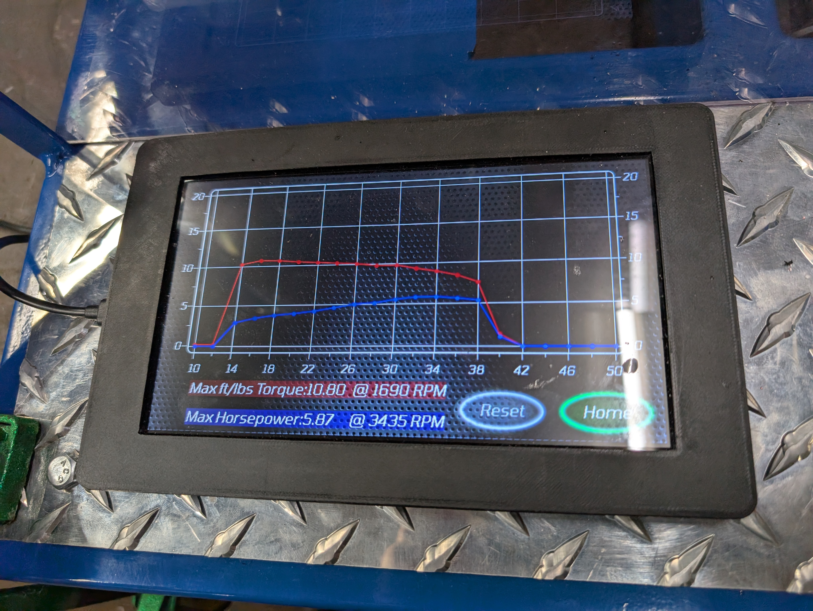

I'm not going to hold your hand, but if you are capable of finishing this project on you own you don't need me to.

I'm no pro at any one part of this project, so don't judge the code structure or the CAD file too closely.

You will need to cut, drill, and weld. You will need to get platformIO up and running in order to upload the code to the touchsreen. You will need to understand enough freeCAD to get the details you need from the cad file. If that sounds like a reasonable enough barrier to entry that want to build one yourself, you are exactly the reason I am open sourcing this project, I'm proud of you.

If you do all of those things, and follow it through, here is the expected result:

The finished dyno has a 16"x16" footprint and can be easily transported to track day with your friends. It is powered by 5 volts over USB-C, I power mine from one of those cheap portable batteries for charging you phone or what have you.

I honestly couldn't tell you the limits of the dyno, a lot of that would come down to your craftsmanship. It does have two gauge/power ranges, the higher one goes up to 40hp, the low range caps at 20hp. You can alsoselect an RPM range, with low topping out at 5000rpm, and high going to 10,000rpm.