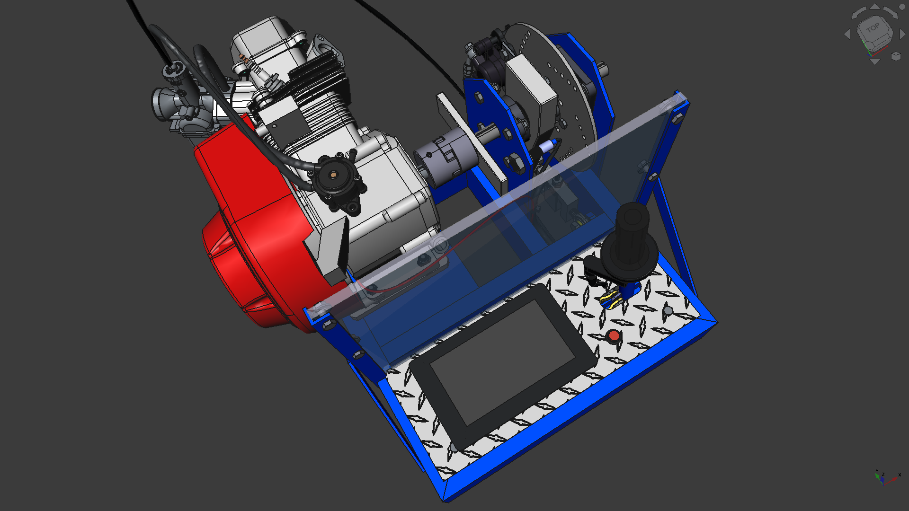
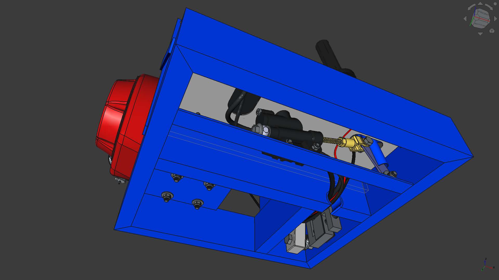
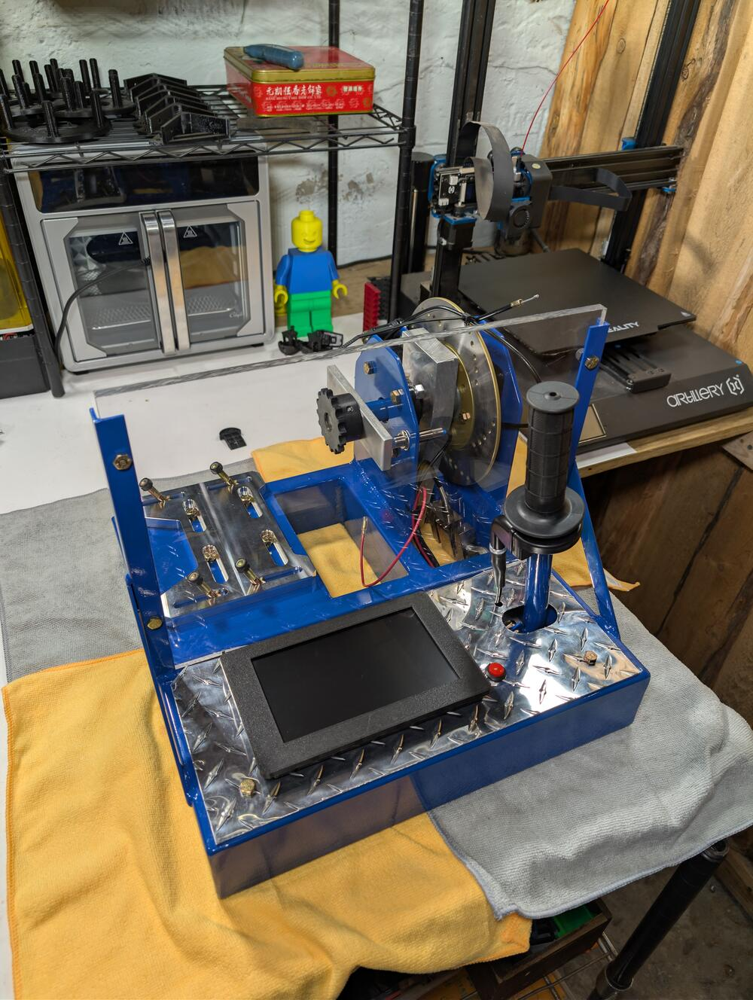
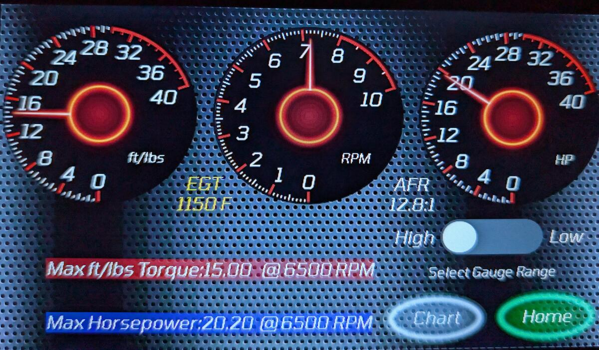
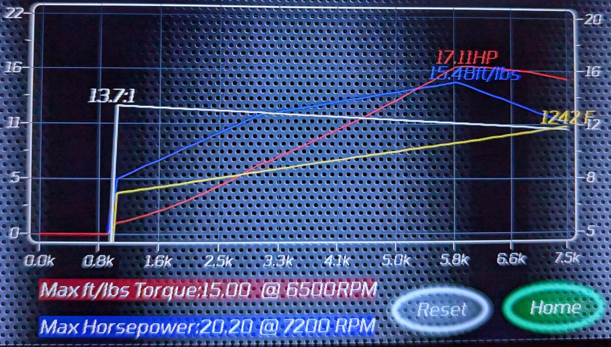
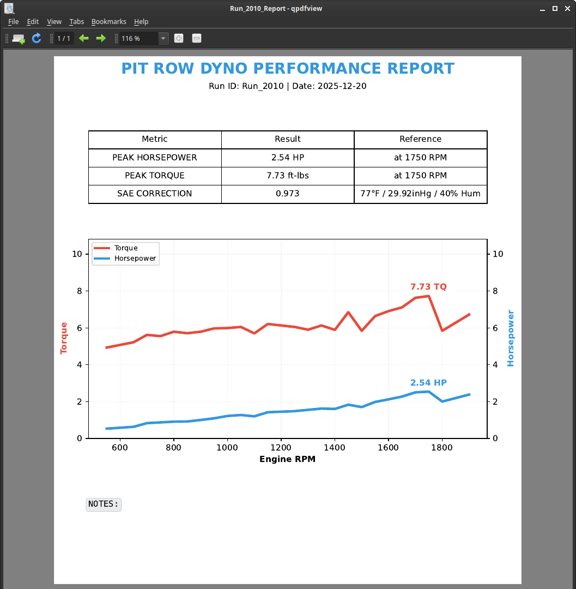
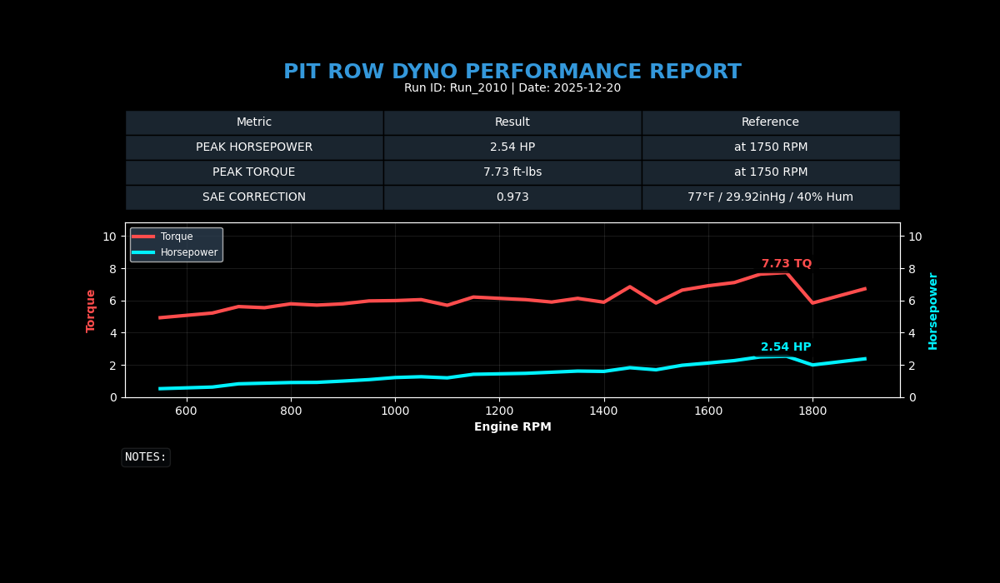
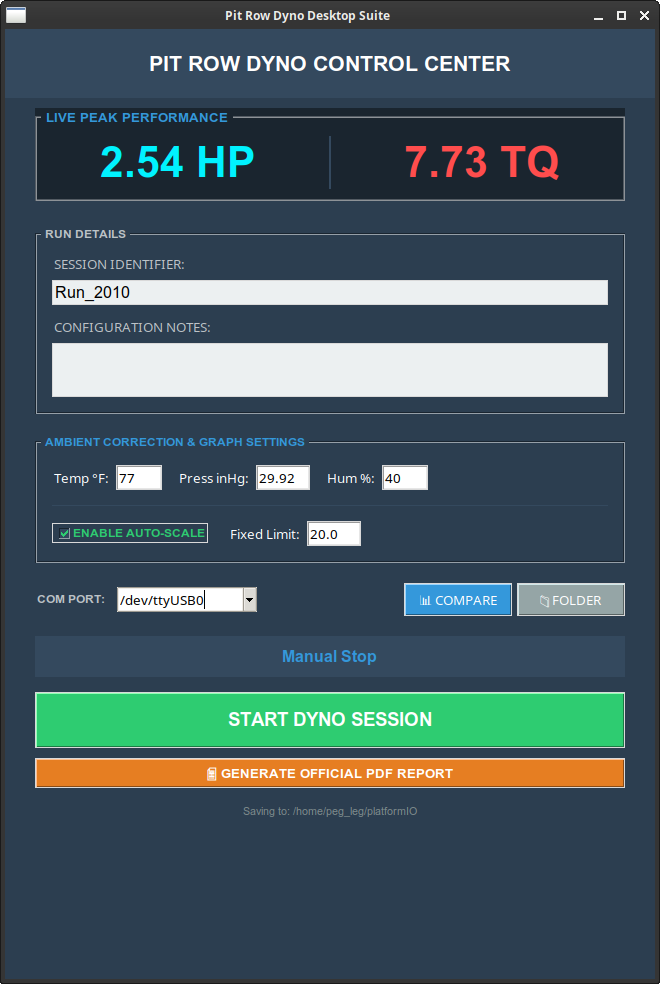

Pit Row Dyno: Open Source DIY Dyno electronics and data acquisition for engine testing.

I'm not going to hold your hand, but if you are capable of finishing this project on your own you don't need me to.

I'm no expert at any one part of this project, so don't judge the code structure or the CAD file too harshly.

You will need to cut, drill, and weld. You will have to solder to the pcb of the touchscreen. A 3D printer will be needed to make the case for the touchscreen. You will need to get platformIO up and running on your computer in order to upload the code to the touchsreen. You will need to understand enough freeCAD to get the parts and hardware breakdown you need from the cad file, along with the dimensions and locations of all the cut/drilled/welded parts. If that all sounds like a reasonable enough barrier to entry that you still want to build one yourself, you are exactly the reason I am open sourcing this project, I'm proud of you.

If you do all of those things, and follow it through, here is what the expected results will look like:

The finished dyno has a 16"x16" footprint and can be easily transported to track day with your friends, or just live in the corner of your shed not taking up much real estate. It is powered by 5 volts over USB-C, I power mine from one of those cheap portable batteries for charging your phone or what have you.

I honestly couldn't tell you the limits of the dyno, a lot of that would come down to your craftsmanship. It does have two gauge/power ranges, the higher one goes up to 40hp, the low range caps at 20hp. You can also select an RPM range, with low topping out at 5000rpm, and high going to 10,000rpm.

Don't want to be hassled with getting all the parts and pieces together, let alone the work of putting it together? Never fear, you can buy one pre built. Go to www.pitrowdyno.com to check it out.